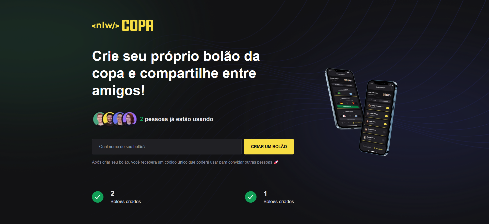
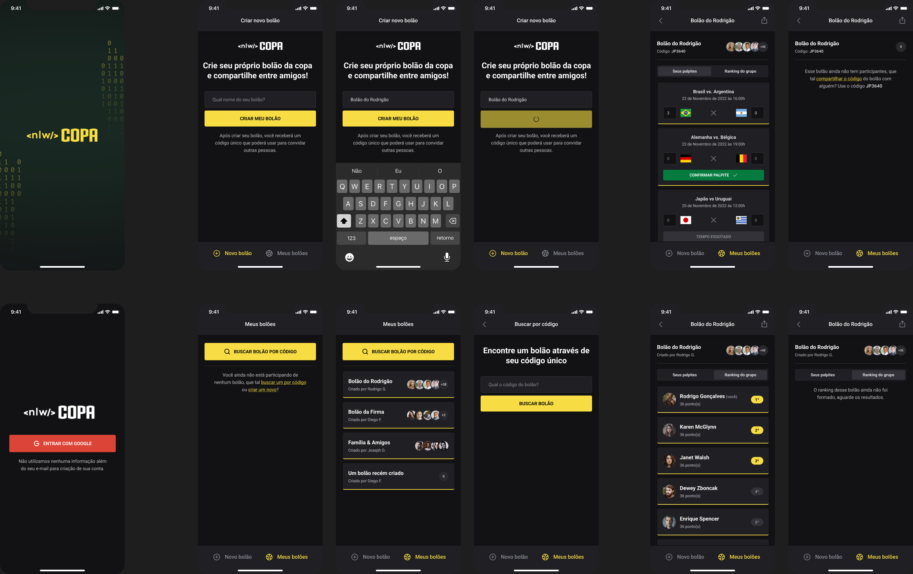

<p align="center">
  
</p>

<p align="center">
  <a href="#-tecnology">Tecnology</a>&nbsp;&nbsp;&nbsp;|&nbsp;&nbsp;&nbsp;
  <a href="#-project">Project</a>&nbsp;&nbsp;&nbsp;|&nbsp;&nbsp;&nbsp;
  <a href="#-license">License</a>
</p>

<p align="center">
 

  
</p>

<br>

## 💻 Project

##### Projeto Front-End, Backend e Mobile Construido durante o NLW Copa

<p>NLW Copa é projeto desenvolvido durante o evento da rocktseat, com ele você é capaz de criar e participar de um Bolão de jogos para dar palpites sobre o jogos da copa</P>


# Preview 🛰

## Web
<p align="center">
  
</p>

## Mobile
<p align="center">
  
</p>

## 🚀 Technology

This project was developed with the following technologies:


<b>Backend</b>
- [Node js]()
- [Fastify]()
- [Prisma]()

<b>Frontend</b>
- [React]()
- [React-Native]()
- [expo]()
- [tailwind css]()
- [Radix-UI]()


## 🛠 Install

1. Clone o repositório:

   ```bash
   $ git clone https://github.com/edsnasc/NLW-Copa.git
   ```
2. execute os comandos 

    ```bash
    $npm install - instale as dependencias
    $npm run dev - execute o server/web
    $expo start - execute o mobile
   ```
---

Created by Edson Nascimento 🚀/ [LinkedIn](https://www.linkedin.com/in/edson-nascimento-5783681aa/)
